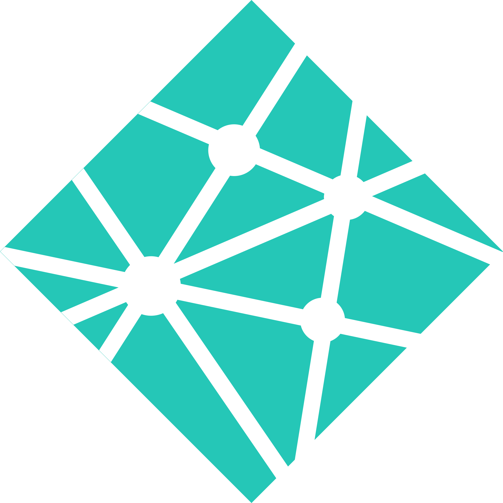

### 👋 Hello World
I'm Alex! I am a first-generation aspiring software engineer with experience in various programming languages, primarily specializing in front-end development. I am currently pursuing an Associate of Arts and Sciences degree in Computing and Software Development at Lake Washington Institute of Technology.

Since November 2019, I have gained hands-on experience in the software engineering field through freelance projects, delivering solutions across various areas and deepening my technical expertise.

* 🎂 My birthday is August 17
* 📅 I started my freelance development career on November 2019
* 🧠 I'm actively learning <a href='https://vuejs.org/' rel="noopener noreferrer" target="_blank">Vue.js</a>, <a href='https://java.com/' rel="noopener noreferrer" target="_blank">Java</a> and <a href='https://reactjs.org/' rel="noopener noreferrer" target="_blank">React.js</a>
* 🧑‍🤝‍🧑 [Connect with me on LinkedIn!](linkedin.alexarizola.dev)
* 📧 [Emailing me is the best way to get in touch!](mailto:contact@alexarizola.dev)
* 📃 [Check out my GitHub resume!](https://resume.github.io/?GhostDaGhost)

<h3>I am currently seeking an employment opportunity or internship as a front-end developer to apply my skills and contribute to a growing and strong team.</h3>

#
### 🌐 Find me on:

    
    &nbsp;
    
    &nbsp;
    

#
### 🛠️ Familiar Programming Languages:

    
    <!--&nbsp;
    -->
    &nbsp;
    
    &nbsp;
    
    &nbsp;
    
    &nbsp;
    
    <!--&nbsp;
    -->
    &nbsp;
    
    &nbsp;
    
    &nbsp;
    
    &nbsp;
    

#
### 🛠️ Familiar Libraries, Tools & Frameworks:

    
    <!-- &nbsp;
     -->
    &nbsp;
    
    &nbsp;
    
    &nbsp;
    
    &nbsp;
    
    <!--&nbsp;
    -->
    &nbsp;
    
    &nbsp;
    
    <!--&nbsp;
    -->
    &nbsp;
    
    &nbsp;
    
    &nbsp;
    
    &nbsp;
    
    &nbsp;
    
    <!-- &nbsp;
     -->

#
### 🖥️ Projects:
I've been involved in the creation and maintaining of various custom frameworks in roleplay servers most commonly written in <a href="https://lua.org/" rel="noopener noreferrer" target="_blank">Lua</a> on a modification off of <a href="https://rockstargames.com/gta-v" rel="noopener noreferrer" target="_blank">Grand Theft Auto V</a> named <a href="https://fivem.net" rel="noopener noreferrer" target="_blank">FiveM</a>.

* <a href='https://github.com/GhostDaGhost/soe-2.0' rel="noopener noreferrer" target="_blank">State of Emergency RP</a> (2019 - 2021)
* New Dawn Gaming (2020 - 2020)
* <a href='https://productionrp.org/' rel="noopener noreferrer" target="_blank">ProductionRP</a> (2021 - Current)

I've also been creating frontend projects! Check them out here:
* <a href="https://alexarizola.dev/" rel="noopener noreferrer" target="_blank">Personal Portfolio v3</a>
* <a href="https://aa-portfolio-v2.netlify.app/" rel="noopener noreferrer" target="_blank">Personal Portfolio v2</a>
* <a href="https://aa-portfolio-v1.netlify.app/" rel="noopener noreferrer" target="_blank">Personal Portfolio v1</a>
* <a href="https://alexarizola.info/" rel="noopener noreferrer" target="_blank">Link Tree v2</a>
* <a href="https://aa-linktree-v1.netlify.app/" rel="noopener noreferrer" target="_blank">Link Tree v1</a>
* <a href="https://classy-choux-2958bf.netlify.app/" rel="noopener noreferrer" target="_blank">Currency Converter</a>
* <a href="https://transcendent-palmier-9cc6ea.netlify.app/" rel="noopener noreferrer" target="_blank">URL Shortener</a>
* <a href="https://sparkly-swan-b4f0e8.netlify.app/" rel="noopener noreferrer" target="_blank">Contact Form</a>
* <a href="https://dainty-tapioca-dbc275.netlify.app/" rel="noopener noreferrer" target="_blank">Weather App</a>
* <a href="https://zippy-cat-24ae8d.netlify.app/" rel="noopener noreferrer" target="_blank">Movie Info App</a>
* <a href="https://sparkly-kelpie-d89b5d.netlify.app/" rel="noopener noreferrer" target="_blank">Password Generator</a>
* <a href="https://clever-wisp-aa80d7.netlify.app/" rel="noopener noreferrer" target="_blank">GitHub User Lookup</a>
* <a href="https://aa-flipacoin.netlify.app/" rel="noopener noreferrer" target="_blank">Coin Flipper</a>
* <a href="https://aa-qrcodegenerator.netlify.app/" rel="noopener noreferrer" target="_blank">QR Code Generator</a>
* <a href="https://aa-ai-image-generator.netlify.app/" rel="noopener noreferrer" target="_blank">AI Image Generator</a>
* <a href="https://aa-rock-paper-scissors.netlify.app/" rel="noopener noreferrer" target="_blank">Rock Paper Scissors</a>
* <a href="https://doj.productionrp.org/" rel="noopener noreferrer" target="_blank">DOJ Simulated Web Tool</a>
* <a href="https://prpwebsite-v2.netlify.app/" rel="noopener noreferrer" target="_blank">ProductionRP Website</a>

#

    
    &nbsp;
    

    

